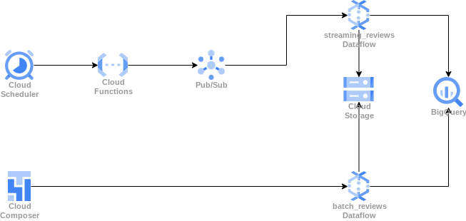

# dataflow-gcp-logs

this started as a repo for dataflow batch job for processing logs (that's why it's called dataflow-gcp-logs)
- [categorize_logs](./categorize_logs/) for taking microservices logs and putting them into folders by service
- [categorize_dag.py](./category_dag.py) for triggering this job

but now i also added:
- streaming reviews generator -> pubsub (check the [terraform](./terraform) directory for resources and function)
- streaming reviews dataflow job - check [streaming_reviews](./streaming_reviews/)
- batch reviews dataflow job - check [batch_reviews](./batch_reviews/)
- airflow dag for triggering the batch reviews job hourly - check [batch_reviews_dag](./batch_reviews_dag)

here is a diagram of the reviews:
